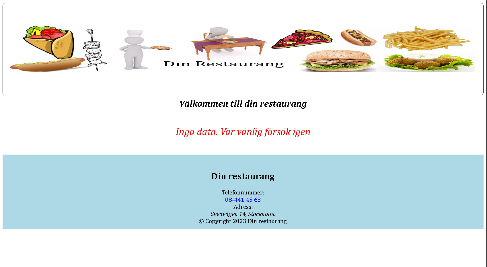

# Din Restaurang

A full-stack restaurant management system with a customer-facing website and admin panel.

## Project Structure

The project consists of three main components:

- **Frontend (dinrestaurang/)**: Customer-facing website consists of meals.
- **Admin Panel (adminpanel/)**: Restaurant management interface
- **Backend (server/)**: RESTful API server

## Prerequisites

- Node.js (v14 or higher)
- Yarn package manager
- Docker and Docker Compose
- MySQL (if running locally without Docker)

## Getting Started

### Installation

1. Clone the repository:

```bash
git clone https://codeberg.org/fadihanna/Din_Restaurang.git
cd Din_Restaurang
```

2. Install dependencies:

```bash
yarn setup
```

### Development

To start the development servers:

```bash
yarn dev
```

This will start:

- Frontend server on port 3000
- Admin panel on port 3001
- Backend API on port 5000

### Database Setup

The project uses MySQL as the database. You can either:

1. Use Docker (recommended):

```bash
docker-compose up -d
```

This will start:

- MySQL database on port 3306
- phpMyAdmin on port 8080

2. Or run MySQL locally and update the configuration in the server's environment variables.

### Seeding the Database

To populate the database with initial data:

```bash
yarn seed
```

## Docker Deployment

The project includes Docker configuration for easy deployment:

```bash
docker-compose up -d
```

This will start all services:

- MySQL database
- phpMyAdmin
- Backend API
- Frontend website
- Admin panel

## Available Scripts

- `yarn setup`: Install all dependencies
- `yarn dev`: Start development servers
- `yarn seed`: Seed the database with initial data
- `yarn clear`: Clean up node_modules and build directories

## Environment Variables

Each component has its own environment variables file:

- `server/.docker.env`
- `server/.env`
- `dinrestaurang/.docker.env`
- `dinrestaurang/.env`
- `adminpanel/.docker.env`
- `adminpanel/.env`

## License

This project is licensed under the MIT License - see the [LICENSE](LICENSE) file for details.

## Screenshot


## Author

Fadi Hanna - [GitHub](https://github.com/fadihanna123)
